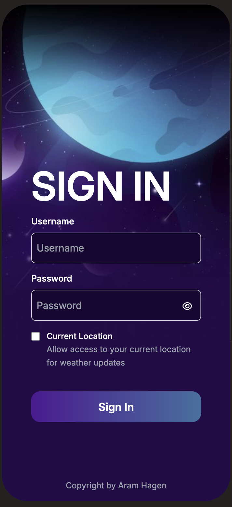
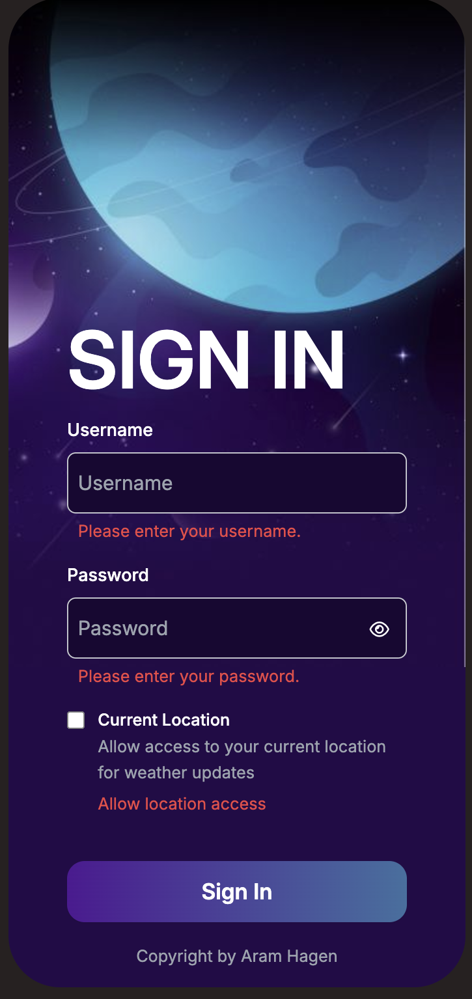
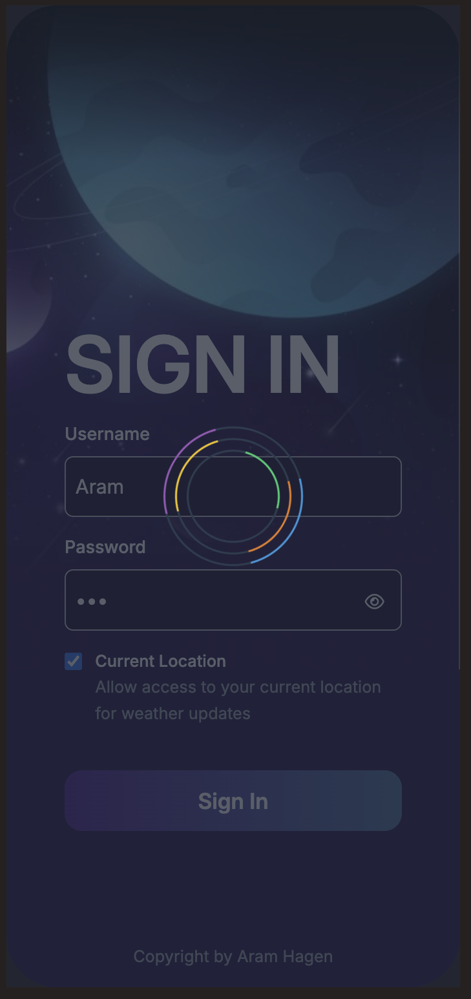
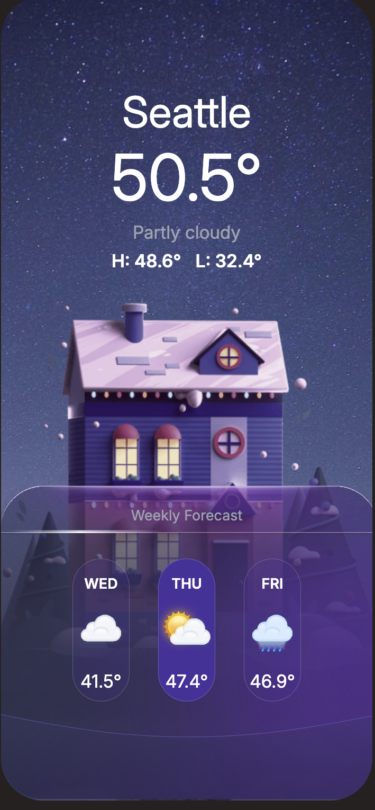

# Weather Application
This is a solution for a Weather Application that provides a 7-day weather forecast and displays the current weather conditions.

## Table of contents

- [Overview](#overview)
    - [The challenge](#the-challenge)
    - [Screenshot](#screenshot)
    - [Links](#links)
- [My process](#my-process)
    - [Built with](#built-with)

## Overview

### The challenge

The application enables users to:

- Currently, there is no authentication implemented, so any username and password can be entered to log in. By checking the checkbox, the app will request access to the user's current location.
- I used [Weather API](https://weatherapi.com/) to fetch the 7-day weather forecast.
- Users can view the current weather conditions for their location, including the high and low temperatures.
- Users can also see the average temperature for the entire week.
- If the user submits the login form without filling in the required fields, error messages will be displayed.
- The password can be shown or hidden by clicking on the eye icon.
- After clicking the login button, the app will show a loading screen and then redirect the user to another page.

### Screenshot

### Links

- Solution URL: [Add solution URL here](https://github.com/AramHagen/weather-app)
- Live Site URL: [Add live site URL here](https://aramhagen.github.io/weather-app/)

## My process

### Built with

- Semantic HTML5 markup
- Tailwind
- Flexbox
- CSS Grid
- Sass (SCSS)
- JavaScript