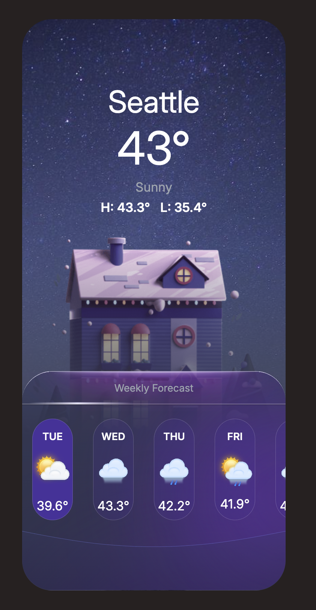

# Weather Application

This project is a Weather App designed to provide users with real-time weather updates and forecasts. Key features include:

- Current Weather: Displays the current temperature, including the high and low temperatures for the day.
- 7-Day Forecast: Users can view the weather forecast for the next seven days at their location.
- Average Weekly Temperature: Shows the average temperature for the entire week.
- Weather Icons: The app uses an icons.json file located in the assets folder to fetch the appropriate weather icon based on the weather code.
- Weather Data Source: The weather data is fetched from the Weather API, providing accurate weather forecasts.

## Table of contents

- [Overview](#overview)
  - [Installation](#Installation)
  - [Run Locally](#run-locally)
  - [Running Tests](#running-tests)
  - [User Flow and Permissions](#user-flow-and-permissions)
  - [Screenshots](#screenshots)
- [My process](#my-process)
  - [Tech Stack](#tech-stack)

## Overview

### Installation

Follow the steps below to set up the project on your local machine:

1. **Install Node.js and npm**  
   Make sure **Node.js** and **npm** are installed. You can download and install them from the [Node.js official website](https://nodejs.org/). The installation of Node.js will also include npm.

   To check if Node.js and npm are installed, run the following commands in your terminal:

   ```bash
   node -v
   npm -v
   ```

2. **Install Project Dependencies**
   After ensuring Node.js and npm are installed, run the following command to install the necessary project dependencies:
   ```bash
   npm install
   ```
   This will download and set up all required node_modules for the project.

### Run Locally

Follow these steps to clone the project and run it on your local machine:

1. **Clone the Project**  
   First, clone the project repository to your local machine using the following command:

   ```bash
    git clone <repository-url>
   ```

2. **Install Project Dependencies**  
   Navigate to the project folder and install the required dependencies:using the following command:

   ```bash
    cd <project-directory>
    npm install
   ```

3. **Build Tailwind CSS**
   To build the Tailwind CSS, run the following command:
   ```bash
    npm run build:css
   ```
4. **Watch for CSS Changes**
   If you want your CSS changes to rebuild automatically as you make changes to the styles, run:

   ```bash
    npm run watch:css
   ```

5. **Add Your API Key**
   The project requires an API key to fetch weather data from the Weather API.
   In your project directory, locate the file where the API key is stored and replace the placeholder with your actual API key.
   For example, in your code, you might find:

   ```bash
    const API_KEY = 'your-api-key-here';
   ```

6. **Run the Project**
   Start the project locally using the following command:
   ```bash
    npm run start
   ```
   This will use npx live-server to serve the project locally.

### Running Tests

This project uses Jasmine for testing. To run the tests, use the command:

```bash
  npm run test
```

After running this command, you’ll receive a link to view the test results and check whether they pass or fail.

### User Flow and Permissions

To get the user’s current location, the app requires permission. Here’s how it works:

1. **Login Template:**
   The app displays a login template on launch. Although no authentication system is implemented, users can enter any username and password to log in.

2. **Permission to Access Location:**
   To access the user’s location, they must check the checkbox granting permission. This allows the app to request access to the user’s current location.

3. **Mandatory Fields:**
   All input fields in the login form must be filled out before submitting. If any required fields are left blank, error messages will be displayed to guide the user.

4. **Password Visibility:**
   The password input field includes an eye icon, which allows users to toggle visibility of the password for easier entry.

5. **Login Submission:**
   Once all fields are filled and the checkbox is selected, the user can click the login button. After clicking the button, a loading screen will appear, and the user will be redirected to another page displaying the weather information.

This version of the app ensures a smooth user experience while focusing on providing reliable weather data and a straightforward login process.

### Screenshots




## My process

### Tech Stack

- Semantic HTML5 markup
- Tailwind
- Flexbox
- CSS Grid
- Sass (SCSS)
- JavaScript
